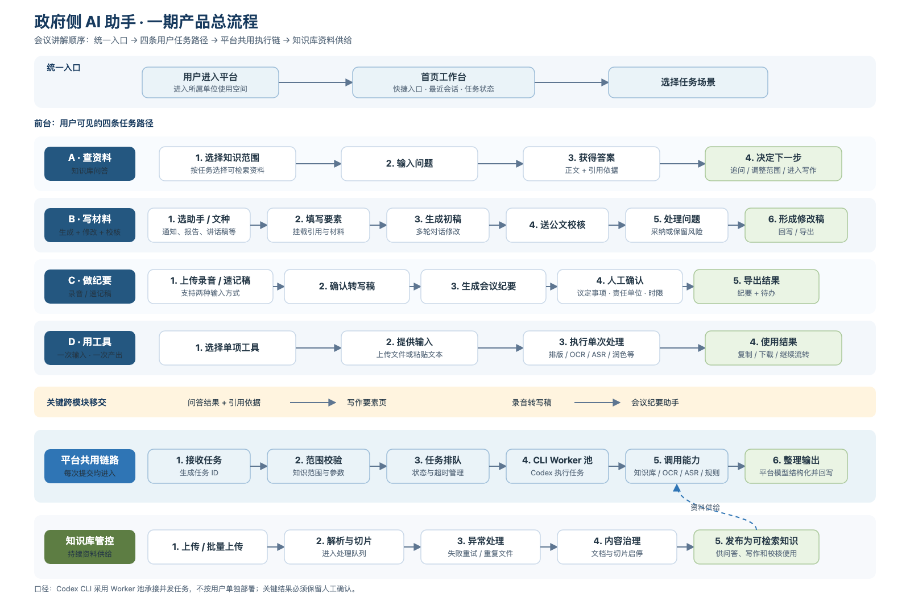

# AI 办公助手平台

面向日常办公场景的 AI 助手产品原型，覆盖知识库问答、AI 工具、材料写作与公文校核、会议纪要及知识库管控。

> 当前仓库以可交互静态 Demo 和产品设计资料为主。页面数据及 AI 结果均为 Mock 示例，不代表生产系统或正式业务结论。



## 主要能力

- **知识库问答**：选择检索范围、自然语言问答、引用溯源、无命中兜底与多轮追问。
- **AI 工具**：公文排版、错别字与用语检查、文本润色、文档速读、OCR、录音转文字。
- **AI 助手**：公文起草、综合材料、讲话稿、内容宣传、公文校核和会议纪要。
- **跨模块流转**：问答携引用进入写作、当前文稿送校核、录音转写进入会议纪要。
- **知识库管控**：文档上传与解析队列、失败重试、文档详情、切片治理及使用数据概览。

## 查看静态 Demo

在线预览：[https://sokripper.github.io/gov-ai-assistant/](https://sokripper.github.io/gov-ai-assistant/)

无需安装依赖或启动服务端：

1. 下载或克隆仓库。
2. 使用 Chrome、Edge 等现代浏览器打开 `docs/prototypes/index.html`。
3. 建议使用 1440×900 或更高分辨率；最低演示分辨率为 1024×768。

静态 Demo 已覆盖 1920×1080、1440×900、1366×768、1280×720、1024×768 五档桌面视口。

## 产品边界

- 基础模型负责语言理解与生成；文档解析、OCR、ASR、确定性规则校验和任务状态管理由专用能力承担。
- AI 生成的文稿、校核建议、纪要责任人与时限均需要人工确认。
- 当前上传、导出、删除等操作仅用于前端交互演示，刷新页面后恢复初始状态。
- 当前版本不接真实模型、向量库、后端接口、账号权限或审计系统。

## 目录结构

```text
docs/
  prototypes/        静态交互 Demo
  diagrams/          产品流程图
  澄清文档/           业务 PRD 对齐稿
pycore/              Python 3.11+ / FastAPI 基础框架
.sdd/                SDD 项目状态、经验与工作日志
```

## 技术说明

- 原型：单页静态 HTML、CSS、JavaScript，无外部运行依赖。
- 后端基础：Python 3.11+、FastAPI、Pydantic、SQLAlchemy Async。
- 正式前端计划：React + TypeScript + Vite + Ant Design。

详细交互说明见 [`docs/prototypes/README.md`](docs/prototypes/README.md)。
