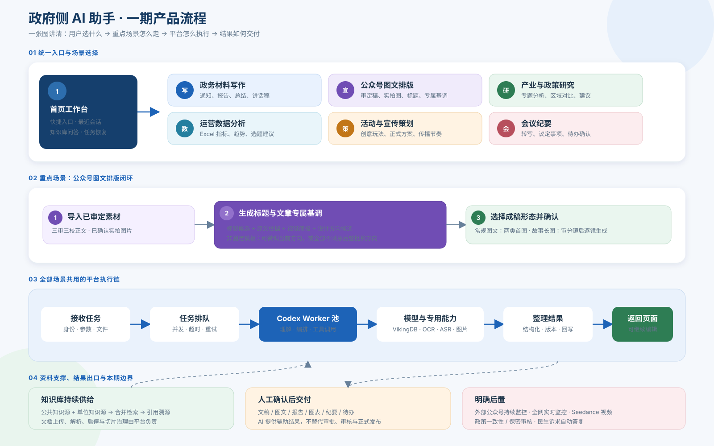

# 政府侧 AI 助手平台业务 PRD 对齐稿 v16

> 阶段：需求梳理与一期 Demo 验证 
> 交付形态：可交互静态网页 Demo（不接真实模型与后端） 
> v16 变更：一期 AI 工具移除独立“宣传配图生成”。公众号所需的首图、装饰素材和故事长图仍保留在“公众号图文排版助手”的完整流程中，不再作为脱离文章的单项工具提供。
>
> v15 变更：活动与宣传策划的创意方向改为单选，一个正式方案只围绕一条核心叙事展开；栏目和互动玩法可在后续成稿中继续调整。候选区同步压缩信息层级，三项方向与操作区尽可能在常规电脑首屏完整显示。
>
> v14 变更：活动与宣传策划改为“输入主题和硬性条件 → 生成创意玩法方向 → 用户选择 → 形成正式工作方案”。模型负责栏目、内容产品、互动方式和传播节奏；人员、日期、责任单位、统计数据与政治表述必须由用户确认。

## 一、产品目标

为机关干部提供一个统一 AI 工作入口，优先解决资料查询、材料生产、宣传内容生产、政策研究、运营分析和会议整理等高频任务。第一期以“能力可落地、输入可获得、结果可人工确认”为选型标准，不建设高成本的持续外部采集系统。

## 二、一期范围

### 2.1 一级模块

1. 知识库问答
2. AI 工具
3. AI 助手
4. 知识库管控

### 2.2 本期 AI 工具

| 分类 | 功能点 | 本期输入与输出 |
|---|---|---|
| 文本处理 | 文本优化与检查 | 粘贴文本，输出错别字/用语提示和优化稿 |
| 文档处理 | 文档速读 | 上传文档，输出摘要、要点和结构大纲 |
| 数据处理 | Excel 统计与图表 | 上传 Excel/CSV，输出指标、趋势和结论 |
| 识别转换 | 图文识别（OCR） | 上传扫描件或图片，输出可编辑文本 |
| 识别转换 | 录音转文字 | 上传录音，输出带说话人与时间轴的转写稿 |

### 2.3 本期 AI 助手

| 分类 | 功能点 | 本期主流程 |
|---|---|---|
| 内容创作 | 政务材料写作助手 | 要素输入 → 初稿 → 多轮修改 → 输出前检查 |
| 内容创作 | 公众号图文排版助手 | 导入审定正文与实拍图 → 生成标题与文章专属视觉基调 → 输出常规图文或故事动漫长图 |
| 研究分析 | 产业与政策研究助手 | 输入研究命题与方向 → 自动检索公开资料 → 交叉核验 → 深度研究初稿 → 人工核对来源 |
| 研究分析 | 运营数据分析助手 | 上传公众号后台数据 → 趋势与文章对比 → 选题建议 |
| 策划事务 | 活动与宣传策划助手 | 主题与硬性条件 → 创意玩法候选 → 选定一个主方向 → 正式工作方案 → 人工补全硬信息 |
| 策划事务 | 会议纪要助手 | 录音/速记稿 → 转写 → 纪要与待办 → 人工确认 |

### 2.4 后置能力

| 能力 | 后置原因 |
|---|---|
| 外部公众号持续监控 | 依赖外部数据源、账号授权、反爬与合规方案 |
| 全网实时监控 | 需要持续采集、去重、时效保障和运维投入 |
| Seedance 文章转视频 | 本期先闭环图文生产，视频生成放在下一阶段评估 |
| 政策一致性审核 | 需上位法来源、版本管理、有效性判断和专业复核 |
| 保密与敏感信息审核 | 涉及分级规则、责任边界和审批机制 |
| 民生诉求自动答复 | 涉及事实认定、政策依据和对外答复责任 |
| 文件对比、表格抽取、多语翻译 | 保留扩展位，不占用本期核心链路开发资源 |

## 三、一期产品流程

讲解顺序：统一入口 → 选择本期场景 → 平台执行任务 → 人工确认结果。公众号图文排版作为本期重点闭环单独展开。

统一技术链路：用户提交任务后，平台创建任务并进入队列；Codex CLI Worker 按任务调用模型、知识库或专用工具；平台将中间结果整理成页面所需结构并回写。Worker 按并发量横向扩容，不按用户部署独立 CLI。

## 四、核心业务流程

### 4.1 知识库问答

- 用户可多选知识库作为检索范围，默认全选；该选择不是权限控制。
- 回答包含正文和引用来源，来源可展开查看文件、页码和命中片段。
- 未命中时明确告知“未找到”，不允许基础模型脱离资料编造。
- 问题、答案和引用可携带到政务材料写作助手继续生成材料。

### 4.2 政务材料、产业研究与活动宣传策划

- 政务材料使用要素表单进入“左侧对话 → 右侧文稿”工作台，用户可直接修改正文，也可通过对话要求补充、精简或重写。
- 产业与政策研究不要求用户上传文件。用户输入研究命题、研究目的和关注方向后，系统先拆解研究问题，再检索国家、省、市、区政府公开资料及权威案例。
- 研究成稿必须把规划目标、当前事实、历史数据和分析判断分开处理；每个关键事实保留可点击来源，无法核实的内容不写入正文。
- 活动与宣传策划以主题、传播目标、受众、现有平台和不可编造内容为输入，第一步只生成差异化创意方向，不直接生成泛化方案；用户单选一个主方向，或对整批方向换新。
- 创意确认后生成正式工作方案，结构包含指导思想、工作目标、组织领导、会前会中会后安排、重点玩法、内容产品与渠道矩阵、任务分工、舆情风险和工作要求。
- 模型可以创作栏目名称、内容产品、互动方式和传播节奏；会议时间地点、领导姓名、组织架构、责任单位、统计数据和政治表述不得自动补写。
- 输出检查只提供风险线索，不输出“审核通过”；事实、政策依据、分析结论、政治表述和正式发布均由人工终审。

### 4.3 公众号图文排版

1. 导入审定素材：用户上传或粘贴已完成三审三校的正文，并上传已经确认的实拍图片；不再填写主题、事实或创作要求。
2. 生成标题：模型只基于原文生成可读的标题候选。每个候选必须标注“原句直接提取、原句压缩、原文栏目标题或主题与核心原句组合”及对应原文依据，不能补充原文没有的事实和判断。
3. 生成文章专属基调：模型从文章中的主题、场景、情绪和信息结构提炼视觉简报，返回若干差异明显的设计方向，包括配色、字体层级、构图节奏、照片呈现和装饰素材语言。候选方向是当前文章的生成结果，不是后台预置的固定模板；用户可反馈“更现代、更克制、减少政务蓝”等意见微调当前方向，也可在全部不满意时整批生成新的方向。
4. 首屏分流：用户先选择常规公众号图文或故事动漫长图，再选择现代科技、专业纪实或人文叙事等视觉气质；审定正文和实拍图片以紧凑摘要展示，不挤占首屏交互区。
5. 常规图文：进入独立排版流程，可逐项确认大标题、小标题、文章专属视觉方向、素色/照片首图和局部排版组件。首图是整体风格的第一块模板，切换视觉方向时必须同步变化配色、构图、字形和照片叠色，不能继续复用与当前方向无关的固定首图。正文和实拍图保持锁定，照片型首图只允许裁切、叠色和排字。
6. 故事动漫长图：系统先生成带原文依据的可编辑草图，每幕包含画面标题、对白/说明、场景与角色状态。用户确认文字后，再把确认文本、构图和风格约束一并提交 Seedream 做图字一体生成；最终预览应使用文字已经进入画面的栅格成图，不得以网页文字浮层伪装成图字一体结果。成图后以 OCR 对照确认文本，发现错字则重生成对应画面。Seedance 完整动效作为同一长图式成稿的动态段落呈现。
7. 人工确认与输出：常规图文确认大标题、小标题、首图、图片顺序和整体基调；故事长图先确认草图文字，再确认图字一体成图与 OCR 结果。成图后若修改文字，需要回到草图并重新生成对应画面。

本期不持续抓取任意外部公众号。常规图文可按需调用 Seedream 生成抽象背景、纹理和标题装饰，不得替代客户已确认的实拍图。故事动漫长图属于明确标注的衍生表达：虚构角色不得冒充真实人物，具体地点、项目状态和事件必须逐镜人工核对。

### 4.4 运营数据分析

- 用户上传公众号后台导出的 Excel/CSV 或自建运营台账。
- 系统识别标题、发布时间、阅读、分享、收藏等字段，计算指标并生成趋势图。
- 模型基于确定性统计结果解释内容表现，给出下期选题和内容结构建议。
- 用户可以围绕同一份数据继续追问；本期不自动获取外部账号的精确运营数据。

### 4.5 会议纪要

- 支持上传录音或速记稿；录音先经 ASR 转写和说话人区分。
- 模型提取议题、讨论结论、议定事项和待办。
- 责任单位、责任人和完成时限必须由参会人员人工确认后导出。

### 4.6 知识库管控

- 支持文件上传、解析队列、失败重试、文档列表、状态启停和切片治理。
- 文档生效后进入可检索范围；停用或删除后不再参与检索。
- 一期按单位空间统一管理，不做部门/个人级权限体系。跨单位公共资源应由平台侧维护公共知识源，再在各单位检索时按配置合并召回；该能力属于正式架构设计，不在静态 Demo 中实现。

## 五、能力边界与技术分工

| 能力 | Codex CLI / 模型承担 | 平台或专用服务承担 |
|---|---|---|
| 任务处理 | 理解意图、拆解步骤、调用工具、生成和整理内容 | 鉴权、任务 ID、队列、超时、取消、重试、限流和状态持久化 |
| 知识问答 | 基于检索结果组织答案 | 文档解析、切片、VikingDB 检索、引用定位和无命中拦截 |
| 产业与政策研究 | 拆解命题、综合公开材料、形成结构化分析和可继续追问的初稿 | 搜索连接器、来源快照、正文抽取、时间与口径校验、引用定位和任务留痕 |
| 活动与宣传策划 | 拆解传播任务、生成差异化玩法、组合栏目与传播节奏、形成方案初稿 | 硬信息字段、方向选择状态、版本管理、任务分工确认、审签记录和导出 |
| 公众号图文排版 | 原文结构识别、可溯源标题提炼、视觉简报、实拍图位置建议、长图分镜与排版计划 | 文件解析、原文版本锁定、对象存储、Seedream 逐镜生成与一致性控制、长图拼接、可选 Seedance 动态化、参数化渲染和导出 |
| 数据分析 | 解释统计结果、生成洞察与建议 | Excel 解析、类型校验、指标计算和图表数据 |
| 会议纪要 | 结构化议题、结论与待办 | 音频处理、ASR、说话人分离和人工确认界面 |
| 输出检查 | 识别语义风险和事实缺口 | 确定性规则、依据版本、修订记录和人工审批 |

第一期原则：专用服务提供可验证输入，模型负责理解和生成，平台控制任务状态，关键结果保留人工确认。

## 六、跨模块状态关联

- 问答 → 写作：携带原问题、回答正文和引用来源。
- ASR → 会议纪要：携带转写稿、发言人和时间轴，避免重复上传。
- 文档上传 → 知识问答：解析成功后进入列表、详情和检索范围；停用后同步退出。
- 公众号排版任务：保存审定正文版本与校验值、标题候选及原文依据、视觉简报与用户反馈/生成批次、成稿形态、实拍图片、照片首图底图、首图形式与动效、图片顺序、装饰素材和参数化组件配置。故事长图另外保存适配判断、角色设定、逐镜原文依据/字幕/场景提示、生成素材和人工确认状态。
- 运营数据 → 继续追问：追问始终绑定当前上传数据集和本次分析结果。
- 静态 Demo 使用浏览器内存保存状态；正式产品必须以任务、会话、数据集、文稿版本和素材记录承接。

## 七、Demo 验收口径

- 四个一级模块可从左侧导航进入。
- 首页和两个广场只把本期 6 个工具、6 个助手作为主入口，后置能力有明确“本期不做”标识。
- 知识库问答可选择检索范围、展示引用、演示无命中，并携引用进入写作。
- 三类通用内容助手可完成要素输入、生成、编辑、多轮修改和输出前检查。
- 公众号图文排版首屏可先选择成稿路径和视觉气质，正文与图片使用紧凑摘要；常规图文可编辑大标题和小标题，并确认至少 3 个文章专属视觉方向、两类首图及局部组件。切换视觉方向时，首图与正文组件必须同步变化。故事长图至少包含 5 幕可编辑草图，每幕保留原文依据；确认文字后进入 Seedream 图字一体生成，最终预览不得依赖网页文字浮层，界面明确成图后改字需重生成对应画面，并展示 OCR 复核与 Seedance 完整动效口径。
- 运营数据分析可选择 Excel/CSV 或示例数据，生成指标、趋势、结论并继续追问。
- 录音转文字可将结果移交会议纪要；纪要可生成正文和待办。
- 知识库管控可演示上传、解析中/失败/已生效、筛选、详情和切片停用。
- 目标桌面分辨率为 1920×1080、1440×900、1366×768、1280×720、1024×768；低于 1024 不纳入本原型验收。
- 全流程可离线点击演示；外部同步、真实模型、真实下载和服务端持久化均使用明确的原型提示。

对齐稿状态：**v12 已同步至交互 Demo；已接入一张图字一体长图效果稿并完成首图—视觉方向联动。Seedream/Seedance 单次调用已验证，实时任务接口、图字一体重生成、OCR 自动复核、用户实拍图和导出链路仍待正式开发。**
