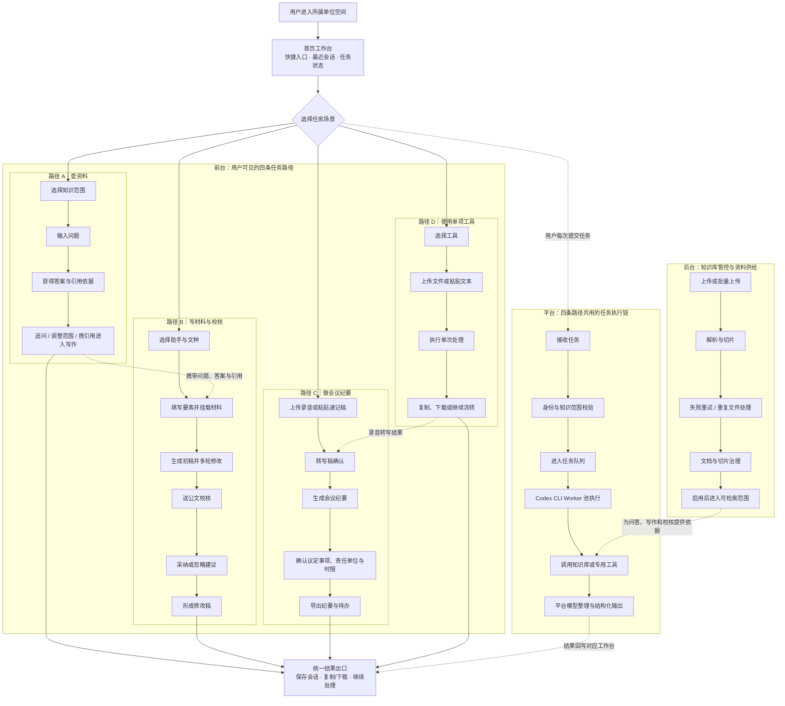

# 政府侧AI助手平台 业务 PRD 对齐稿 v3

> 阶段：需求梳理（业务口径层）
> 交付形态：可交互静态网页 Demo（不做前后端开发、不接真实模型）
> v3 变更：在 v2 范围收窄基础上，补充基础模型能力边界、跨模块状态流和 AI 结果人工复核口径

## 技术前提（仅记录会改变产品口径的部分）

- 底层模型：**豆包（Doubao）系列**
- 知识库方案：**直接使用豆包 VikingDB**；备选 RAGFlow 开源框架（尚未定，不影响本期 Demo）
- 一期不自建复杂链路，工作流先直接接基础模型跑通
- **直接后果：一期知识库不做权限体系**，统一入库管理，无「可见范围」「部门隔离」「个人库」概念

### 一期能力边界

| 能力 | 一期实现口径 | 不应交给基础模型单独完成的部分 |
|---|---|---|
| 知识问答 | VikingDB 检索召回 + 豆包基于召回内容组织答案 | 权限判断、文档解析、切片索引、引用定位、无命中拦截 |
| 公文写作 | 豆包理解要素、生成和多轮改写，引用知识库素材 | 法定格式强约束、模板字段校验、事实真实性和正式签发 |
| 公文校核 | 规则先查确定性问题，模型辅助识别语义和表述风险 | 政治表述最终判断、正式发文通过结论、修订留痕 |
| 文本小工具 | 文本模型承担润色与语义判断 | 字体字号、版心、标点和数字等确定性规则校验 |
| 文件小工具 | 模型消费解析后的文本并摘要或结构化 | Office/PDF 解析、OCR、ASR、文件安全扫描 |
| 会议纪要 | ASR 转写后由模型抽取议题、结论与待办 | 音频解码、说话人分离、责任人与时限的最终确认 |

一期快速上线的原则是“规则／专用服务提供可验证输入，基础模型负责语言理解和生成，关键结果保留人工确认”，不把模型输出包装成确定事实或正式审批结果。

## 目标

为机关干部提供统一入口的 AI 助手平台：日常问知识、用小工具处理文档、找专职助手写材料和审材料；同时让管理员能看清、管住单位沉淀的文件资产。一期以**快速跑通场景**为第一优先级。

## 范围

- 包含：
  - 左侧一级导航四大模块：知识库问答、AI 工具、AI 助手、知识库管控
  - 各模块页面结构、功能点清单、典型交互流程
  - 一期收窄后的 6 个 AI 工具、6 个 AI 助手
  - 知识库统一入库管理：上传、解析状态、文档列表、切片治理、通览看板
- 不包含：
  - **知识库权限体系**（可见范围、部门隔离、个人知识库）——一期明确不做
  - 角色体系与账号权限（一期不区分普通用户/管理员）
  - 真实模型接入、RAG 召回调优、切片策略、向量库选型验证
  - 后端接口开发、数据库设计、单点登录、审计日志
  - 移动端 / 小程序形态

---

## 一期产品总流程（会议讲解版）

讲解顺序：先看用户如何完成任务，再看平台如何统一处理，最后看知识库如何为各场景持续供给资料。

流程口径：Codex CLI 以 Worker 池承接并发任务，不按用户部署独立 CLI；知识库、OCR、ASR、规则校验等作为可调用能力，由平台统一编排；平台结果模型负责把执行结果整理为前端需要的答案、文稿、问题清单、纪要或工具结果。

---

## 业务场景

### 场景1：统一入口与左侧导航

- 左侧固定一级导航四项：知识库问答、AI 工具、AI 助手、知识库管控
- 一期四项对所有用户可见，不做角色区分
- 导航下方为「最近会话」，按时间倒序列出最近 10 条，可重命名、删除
- 右上角为用户信息与所属部门（展示用）

### 场景2：知识库问答

- 进入即对话页，空态给 4-6 条示例问题
- 提问前可选择检索的知识库（按业务主题分库，如政策法规库、本单位制度库、办事指南库），可多选，**默认全选**。这是检索范围选择，不是权限控制
- 回答区：正文答案 + 引用来源卡片（文件名、所属知识库、命中段落、页码），点击展开原文片段
- 答案下方：复制、重新生成、点赞/点踩+原因、「转到 AI 助手继续写」
- 支持多轮追问，答案末尾给 3 条推荐追问
- 无命中时明确回答「知识库中未找到相关内容」，给出建议动作（换个说法 / 扩大知识库范围 / 联系管理员补充资料），**不允许无依据编造**

### 场景3：AI 工具（工具广场）

- 卡片式工具广场，按分类分组，支持搜索与收藏置顶
- 工具口径：**一次输入、一次产出、不带上下文会话**，用完即走
- 点击进入「左输入 / 右结果」独立工作台，结果支持复制、下载、重新生成
- 输入统一支持「上传文件 + 粘贴文本」双通道
- 一期工具清单（按政务高频收窄至 6 个）：

| 分类 | 工具名称 | 一句话说明 | 政务高频理由 |
|---|---|---|---|
| 文字加工 | 公文格式排版 | 按党政机关公文格式国家标准一键规范排版 | 发文前必过，人人要用 |
| 文字加工 | 错别字与用语检查 | 错别字、标点、数字用法、计量单位规范检查 | 材料把关刚需 |
| 文字加工 | 文本润色 | 书面化、精简、扩写三种模式改写 | 日常改稿最高频 |
| 文档处理 | 文档速读 | 上传长文档，输出摘要、核心要点与结构大纲 | 上级文件、政策通读量大 |
| 文档处理 | 图文识别（OCR） | 扫描件、图片、纸质文件转可编辑文本 | 纸质件、红头扫描件多 |
| 音视频 | 录音转文字 | 会议录音转写，区分发言人，可导出速记稿 | 会议密集，纪要刚需 |

- 二期候选（广场中卡片占位，点击提示「即将上线」）：文件对比、表格抽取、多语翻译、数据图表生成

### 场景4：AI 助手 —— 写作类

- 助手口径：**带角色设定、可挂知识库、多轮对话、有产出物**，页面为「左对话 / 右文稿编辑区」双栏，右侧可直接改、整段重写、导出 Word
- 进入助手先走「要素表单」（文种、主送单位、事由、字数、风格），**可跳过**直接对话
- 助手默认挂载知识库作素材来源，可关闭
- 一期清单：

| 助手名称 | 覆盖场景 | 政务高频理由 |
|---|---|---|
| 公文起草助手 | 通知、请示、报告、函、批复，按文种模板生成 | 机关第一刚需 |
| 综合材料助手 | 工作总结、工作计划、情况汇报、经验做法 | 年终、季度、专项报送量最大 |
| 讲话稿助手 | 领导讲话、会议致辞、发言提纲、主持词 | 办公室核心业务 |
| 政务宣传助手 | 政务新闻稿、政策解读稿、政务新媒体推文 | 宣传口日常产出 |

### 场景5：AI 助手 —— 审核类

- 统一产出形态：**左侧原文标注 + 右侧问题清单**，每条含「问题类型 / 原文位置 / 风险说明 / 修改建议 / 依据来源」，逐条采纳或忽略，采纳后原文同步修改
- 顶部给总体结论：有风险待修改 / 建议已全部采纳 / 已处理但仍有忽略风险，并按类型统计问题数。**AI 校核不作为正式发文通过结论**
- 一期只做一个助手，但把维度做全：

| 助手名称 | 检查维度 |
|---|---|
| 公文校核助手 | ① 格式规范 ② 文字差错（错别字、标点、数字、计量单位）③ 用语规范 ④ **政治表述与提法风险**（称谓、重要提法、统一口径） |

- 二期候选：保密与敏感信息审核助手、政策一致性审核助手（均占位提示「即将上线」）

### 场景6：AI 助手 —— 事务类

| 助手名称 | 覆盖场景 |
|---|---|
| 会议纪要助手 | 上传录音或速记稿，产出规范纪要 + 议定事项 + 待办清单（责任单位、时限） |

- 二期候选：民生诉求答复助手。该场景涉及事实认定、政策依据和对外正式答复，需在引用校验、业务规则与人工复核机制完成后上线。

### 场景7：知识库管控 —— 通览数据

- 入口：左侧「知识库管控」，默认落在「总览」页
- 顶部指标卡：知识库数量、文档总数、知识切片数、存储占用、解析失败数、近 30 天新增文档数
- 图表区：近 30 天文档新增趋势、文档类型分布、各知识库文档数排名
- 使用侧数据：近 30 天问答调用量、知识命中率、无答案率、被引用最多的 Top10 文档（可点击跳详情）
- 三类治理待办入口：解析失败、30 天内无人引用、疑似重复，点击直接筛出对应文档列表

### 场景8：知识库管控 —— 统一入库管理

- 支持拖拽上传、点击上传、批量上传；支持 PDF / Word / Excel / PPT / TXT / 图片扫描件
- 上传时指定：**归属知识库、文档分类标签**（不再需要设置可见范围）
- 上传后进入解析队列，状态可见：排队中 → 解析中 → 已生效 / 解析失败
- 解析失败给出可读原因（格式不支持、文件加密、内容为空、超出大小限制），支持重试
- 同名文件提示「已存在同名文档」，可选择覆盖为新版本或另存为新文档

### 场景9：知识库管控 —— 文档列表与治理

- 列表字段：文档名称、所属知识库、分类标签、格式、大小、切片数、上传人、上传时间、状态、近 30 天被引用次数
- 支持按知识库、状态、标签、上传时间筛选与关键词搜索
- 单条操作：查看详情、预览切片、重新解析、启用/停用、删除
- 文档详情页展示原文预览与切片列表，**切片可单条查看、单条停用**（错误内容精准屏蔽，不必删整篇）
- 批量操作：批量停用、批量删除，删除需二次确认

### 场景10：Demo 交付形态边界

- 交付物为一套可点击、可跳转、可切换状态的静态网页，用于评审与汇报演示
- AI 回答、审核结论、解析进度、看板数据均为预置示例数据，不接真实模型与后端
- 上传、删除、导出仅做前端状态变化与提示，刷新后恢复初始态
- 四大模块主流程都能走通，含空态、加载态、失败态各一处示例

### 场景11：跨模块流转

- 问答命中后，可把“原问题 + 回答正文 + 引用来源”移交到公文起草要素页
- 写作工作台维护当前文稿版本；对话修改和直接编辑均进入送审稿
- 公文校核接收当前送审稿；采纳项形成修改稿，忽略项继续保留风险，可回写写作工作台
- 录音转文字完成后，可把带说话人和时间轴的转写稿移交到会议纪要助手
- 上传解析成功后，文档进入文档列表、详情与问答检索范围；停用／删除后不再参与检索
- 上述流转在 Demo 中为内存状态，正式产品需由会话、文稿版本、审核任务、解析任务等后端实体承接

---

## 验收口径

- 左侧导航能进入四大模块
- 知识库问答能多选知识库提问，答案带可展开引用来源，并能演示一次「无命中」回答
- AI 工具广场能看到 6 个一期工具 + 二期占位卡片；每个一期工具能走通「输入 → 出结果 → 复制/下载」
- AI 助手广场区分写作类、审核类、事务类；写作类能演示「要素表单 → 对话 → 右侧出文稿 → 编辑导出」；公文校核助手能演示「上传原文 → 出问题清单 → 逐条采纳 → 原文更新」
- 知识库管控总览页能看到指标卡、趋势图、类型分布、Top10 被引用文档、三类治理待办
- 知识库管控能演示拖拽上传、解析中/失败/已生效三种状态、筛选、文档详情与切片单条停用
- 全流程在浏览器中点击演示，不依赖任何服务端

---

## 已对齐结论

1. **底层模型**：豆包（Doubao）系列
2. **知识库方案**：豆包 VikingDB，备选 RAGFlow；**一期不做权限体系**，统一入库管理
3. **工具 / 助手边界**：工具＝单次一进一出、助手＝多轮带产出物
4. **功能收窄**：一期 6 个工具 + 6 个助手，均按政务高频场景挑选；其余二期占位
5. **审核类合并**：政治表述风险并入「公文校核助手」作为检查维度之一，一期不单独立助手
6. **角色体系**：一期不做，四大模块对所有用户可见
7. **视觉方向**：C 融合方案——政务蓝统一色板，用户侧低密度强引导，管控侧高密度表格看板
8. **Demo 规模**：12-15 屏

对齐稿状态：**v3 已同步至交互 Demo，待业务评审确认**
